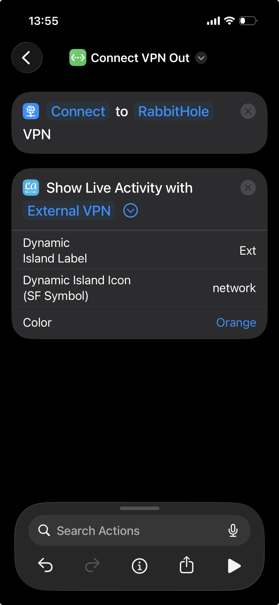
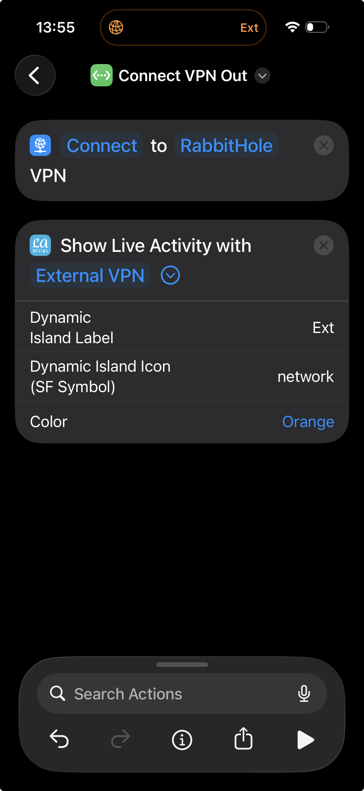
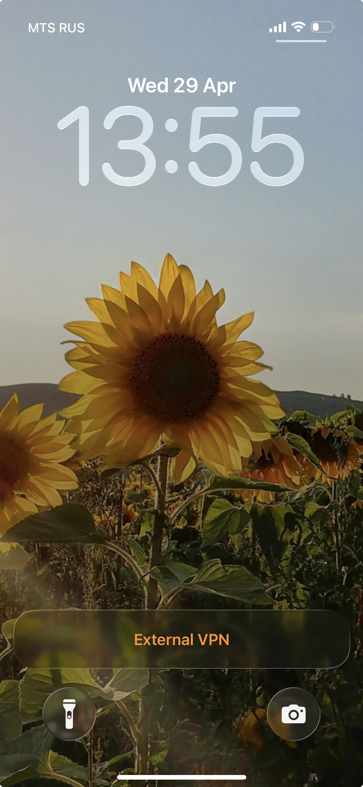

# LA Status

Minimal iPhone app for showing custom text in **Live Activity** and **Dynamic Island** via Shortcuts.

  

## What it does

- Starts and updates a Live Activity with two labels:
  - Lock Screen / Live Activity label
  - Dynamic Island label
- Stops the Live Activity
- Works with **Shortcuts** via App Intents

## Requirements

- Xcode 15+
- iOS 17+
- Apple Developer team selected in Xcode
- Physical iPhone with Dynamic Island for Island UI (Live Activity on Lock Screen works on supported iPhones)

## Run the app

1. Open `LAStatus/LAStatus.xcodeproj` in Xcode.
2. Set your Development Team for:
  - `LAStatus`
  - `LAStatusWidgetExtension`
3. Ensure both targets use App Group:
  - `group.com.lastatus.shared`
4. Add a 1024x1024 app icon in `LAStatus/Assets/AppIcon`.
5. Build and run on device.

After first launch, allow Live Activities if prompted.

## Shortcuts actions

The app provides two Shortcuts actions:

- **Show Live Activity** - start or update activity with both labels
- **Hide Live Activity** - end activity

## How to use with Shortcuts

1. Add action **Show Live Activity**.
2. Set Live Activity **Title**.
3. Set Dynamic Island **Label**.
4. Optional: set Dynamic Island Icon (SF Symbol) from [SF Symbols](https://developer.apple.com/sf-symbols/) and **Color**.
5. Run the shortcut.
6. When you’re done, use **Hide Live Activity**.

## Project structure

- `LAStatus` - app target
- `LAStatusWidgetExtension` - Live Activity UI for Lock Screen and Dynamic Island
- `LALiveActivityManager` - start / update / end logic
- `LAStatusStorage` - shared state via App Group `UserDefaults`
- `LAShortcutsIntents.swift` - Shortcuts/App Intents actions

## Default identifiers

- App bundle ID: `com.lastatus.LAStatus`
- Widget bundle ID: `com.lastatus.LAStatus.LAStatusWidget`
- App Group: `group.com.lastatus.shared`

If you change bundle IDs, keep app and widget prefixes aligned.
